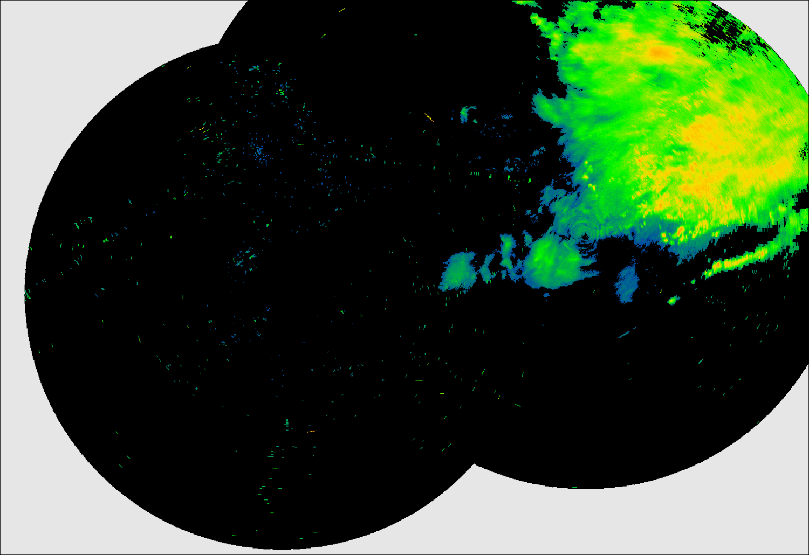
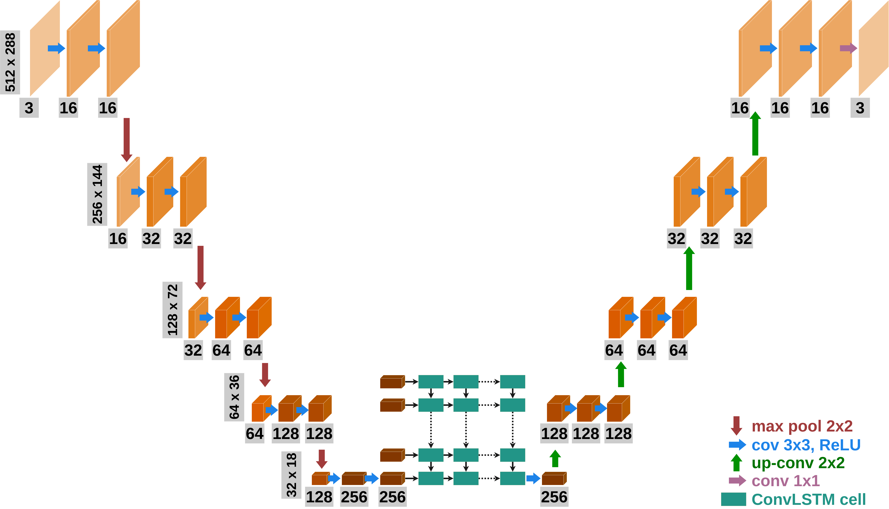

# Cloud and Precipitation Forcasting Using Convolutional LSTM

## Table of Contents

1. [About](#about)
2. [Features](#features)
3. [Data](#data)
4. [Models](#models)
5. [Installation](#installation)
6. [License](#license)
7. [Sources](#sources)

## About

ConvLSTM-Cloud-Prediction is a project aimed at precipitation and cloud forecasting using radar data and Convolutional Long Short-Term Memory networks. It includes a baseline ConvLSTM model as well as a ConvLSTM model extended with an encoder-decoder architecture to improve forecast accuracy and reduce memory usage. The methodology, experiments, and results are all explained in the conference paper "Precipitation and Cloud Forecasting Using Radar Data and Encoder-Decoder Convolutional LSTM", intended for presentation at the ITAT 2025 conference.

## Features

- Utilizes ConvLSTM architecture for cloud movement prediction.
- Training and evaluation conducted using PyTorch.
- Pretrained models available in the `Models` directory.
- Output files in MP4 format located in the `Output_files` directory.
- Commented codes provided in `src`.
- Conference article titled "Precipitation and Cloud Forecasting Using Radar Data and Encoder-Decoder Convolutional LSTM" (ITAT 2025) is available in PDF format as `.pdf`.
- Hardware used for training: 
  - Processor: AMD EPYC 7543P
  - RAM: 512 GB
  - GPUs: 2x NVIDIA A100 with 40 GB memory

## Data

The data used for training and evaluation was provided by the Slovak Hydrometeorological Institute ([SHMÚ](https://www.shmu.sk/sk/?page=1)). The dataset includes radar images taken every 5 minutes from January 2016 to September 2023 (814,499 images total). 

## Models

The project employs two types of models:

1. **ConvLSTM**: Convolutional LSTM serving as the baseline model
2. **ConvLSTM with Encoder-Decoder**: Adds an encoder-decoder architecture to reduce the input size before entering the ConvLSTM part. This lets us use more ConvLSTM layers without running into memory issues.

## Installation

To install the project, follow these steps:

1. Clone the repository.
2. Navigate to the project directory.
3. Install dependencies using `pip install -r requirements.txt`.

## License

This project is licensed under the [MIT License](LICENSE).

## Sources

The architecture source code was inspired by [Video Frame Prediction using ConvLSTM Network in PyTorch](https://sladewinter.medium.com/video-frame-prediction-using-convlstm-network-in-pytorch-b5210a6ce582).
